```mermaid
%%{init: {'theme':'dark'}}%%
mindmap
  root((🚀 Prince Kumar))
    📊 Data Science
      📈 Data Analysis
      📉 Data Visualization
      📐 Statistical Analysis
      🔍 EDA
    🤖 Machine Learning
      ✅ Supervised Learning
      ❌ Unsupervised Learning
      🧠 Deep Learning
      💬 NLP
      👁️ Computer Vision
    💻 Programming
      🐍 Python
      🗄️ SQL
      📝 Git
      🌐 HTML/CSS
      ⚡ JavaScript
    🛠️ Frameworks
      🔥 TensorFlow
      ⚡ PyTorch
      🎯 Scikit-learn
      🌐 Django
      🍶 Flask
      ⚙️ FastAPI
      📊 Streamlit
    📦 Databases & APIs
      🐬 MySQL
      🍃 MongoDB
      🐘 PostgreSQL
      🔴 Redis
      🔗 GraphQL
      📮 REST APIs
    🔧 DevOps Tools
      📓 Jupyter
      🐳 Docker
      🐧 Linux
      📊 Power BI
      🚀 Git & GitHub
```

<div align="center">

# 👋 Welcome to My Digital Space! 


### 🌟 Data Scientist | Machine Learning Enthusiast | Python Developer

</div>

---

## 🚀 About Me


```python
class DataScientist:
    def __init__(self):
        self.name = "Prince Kumar"
        self.role = "Data Scientist"
        self.location = "India 🇮🇳"
        self.education = "B.Tech"
        self.languages = ["Python", "SQL"]
        self.current_focus = [
            "Machine Learning",
            "Deep Learning", 
            "Data Analysis",
            "MLOps"
        ]
    
    def say_hi(self):
        print("Thanks for dropping by! Let's connect!")

me = DataScientist()
me.say_hi()
```

### 🎯 Current Focus

- 🔭 Working on **[Email Spam Classifier](https://github.com/princekumar72550/Email-Spam-Classifier)**
- 🌱 Learning **Advanced ML & Deep Learning**
- 👯 Looking to collaborate on **AI/ML Projects**
- 💬 Ask me about **Python, ML, Data Science**
- 📫 Reach me at **work. kumarprince@gmail.com**
- ⚡ Fun fact: **Data + Coffee = Magic** ☕📊

<br clear="right"/>

---

## 🌐 Connect With Me

<div align="center">
  
<table>
<tr>
<td align="center" width="33%">
<a href="https://www.linkedin.com/in/prince-kumar-5b3418258/">

<br><br>

</a>
</td>

<td align="center" width="33%">
<a href="https://www.kaggle.com/princekumar2694">

<br><br>

</a>
</td>

<td align="center" width="33%">
<a href="https://leetcode.com/u/princekumar6695/">

<br><br>

</a>
</td>
</tr>

<tr>
<td align="center" width="33%">
<a href="https://stackoverflow.com/users/25184213/prince-kumar">

<br><br>

</a>
</td>

<td align="center" width="33%">
<a href="mailto:work.kumarprince@gmail.com">

<br><br>

</a>
</td>

<td align="center" width="33%">
<a href="https://princemmdu.onrender.com">

<br><br>

</a>
</td>
</tr>

<tr>
<td align="center" colspan="3">
<a href="https://www.instagram.com/prince_raj_1_6/">

<br><br>

</a>
</td>
</tr>
</table>

</div>

---

<h2 align="center">💻 Tech Stack</h2>

<div align="center">


</div>

<div align="center">

<table style="background-color: #0d1117; border-radius: 15px; padding: 20px;">
<tr>
<td valign="top" width="50%">

###  Programming Languages

<div align="center">


</div>

###  Machine Learning & AI

<div align="center">


</div>

###  Data Science & Analytics

<div align="center">


</div>

</td>
<td valign="top" width="50%">

###  Frameworks & Tools

<div align="center">


</div>

###  DevOps & Version Control

<div align="center">


</div>

###  Databases & APIs

<div align="center">


</div>

</td>
</tr>
</table>

</div>

---

<h2 align="center">📊 GitHub Statistics</h2>

<div align="center">
  
</div>

<div align="center">

<table>
<tr>
<td width="50%" align="center">
  
  
  
  <br><br>
  
  

</td>

<td width="50%" align="center">

  
  
  <br><br>
  
  

</td>
</tr>
</table>

</div>

<div align="center">

### 🏆 GitHub Trophies


</div>

---

<h2 align="center">📈 Profile Summary</h2>

<div align="center">
  
</div>

<div align="center">


<table>
<tr>
<td width="50%">


</td>
<td width="50%">


</td>
</tr>
</table>

<table>
<tr>
<td width="50%">


</td>
<td width="50%">


</td>
</tr>
</table>

</div>

---

<h2 align="center">🎯 Skills Visualization</h2>

<div align="center">



</div>

---

## 💼 Featured Projects

<div align="center">

<table>
<tr>
<td width="50%">

### 🚀 Email Spam Classifier

[](https://github.com/princekumar72550/Email-Spam-Classifier)

**Tech Stack:** Python, Machine Learning, NLP

A machine learning project to classify emails as spam or not spam using NLP techniques. 

[🔗 View Project](https://github.com/princekumar72550/Email-Spam-Classifier)

</td>
<td width="50%">

### 📊 More Projects Coming Soon! 


**Stay Tuned! **

Working on exciting Data Science and ML projects. Check back soon! 

[🔗 View All Repos](https://github.com/princekumar72550?tab=repositories)

</td>
</tr>
</table>

</div>

---

## 💡 Random Dev Quote

<div align="center">


</div>

---

## 📊 Contribution Snake

<div align="center">

<picture>
  <source media="(prefers-color-scheme: dark)" srcset="https://raw.githubusercontent.com/princekumar72550/princekumar72550/output/github-contribution-grid-snake-dark.svg">
  <source media="(prefers-color-scheme: light)" srcset="https://raw.githubusercontent.com/princekumar72550/princekumar72550/output/github-contribution-grid-snake.svg">
  
</picture>

</div>

---

<div align="center">


### 💖 Show some ❤️ by starring some of my repositories! 

<a href="https://github.com/princekumar72550">
  
</a>

<br><br>

**✨ Made with ❤️ by Prince Kumar**

*"Code is like humor. When you have to explain it, it's bad." – Cory House*

<br>


</div>
